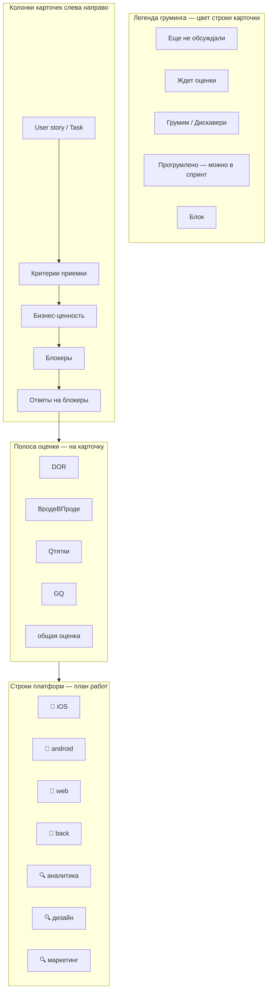

# Holst boards (MCP + parsed backups)

## When to use

- User references a **Holst board** by name, URL (`app.holst.so/board/…`), or alias.
- User asks to inspect a **frame** («фрейм Витрина», «на доске PBR»).
- User wants board content summarized, turned into tasks, PRD input, etc.

Prefer **MCP tools** when the `holst` server is connected.

---

## Setup (once)

1. Build connector:

```bash
cd {{HOLST_CONNECTOR_ROOT}}
npm install && npm run build
npx playwright install chromium
```

Or one command after clone:

```bash
npm run holst:install
```

2. Login (saves `~/.holst/auth.json`):

```bash
npm run holst:login
```

3. Optional aliases **`~/.holst/boards.json`** (локально, **не в git** — см. `examples/boards.json`):

```json
{
  "Example board": "00000000-0000-4000-8000-000000000001"
}
```

Подставьте свои названия и UUID из URL `app.holst.so/board/{uuid}`.

4. Register MCP in `~/.cursor/mcp.json`:

```json
{
  "mcpServers": {
    "holst": {
      "command": "node",
      "args": [
        "{{HOLST_CONNECTOR_ROOT}}/dist/stdio-entry.js"
      ],
      "env": {
        "HOLST_STORAGE_STATE": "~/.holst/auth.json",
        "HOLST_CACHE_DIR": "~/.cache/holst-boards",
        "HOLST_PARSER_ROOT": "{{HOLST_CONNECTOR_ROOT}}/python"
      }
    }
  }
}
```

Reload MCP after changes.

---

## MCP tools

| Tool | Purpose |
|------|---------|
| `holst_login_status` | Check auth file exists |
| `holst_sync_board` | Download `.holst` if stale + parse to markdown cache |
| `holst_list_frames` | Frame names, slugs, child counts |
| `holst_get_frame` | Markdown for one frame (by label/slug/id) |
| `holst_parse_backup` | Parse local `.holst` without download |

Default cache: `~/.cache/holst-boards/{boardId}/parsed/`

---

## Agent workflow

1. **`holst_login_status`** — if missing auth, tell user to run `npm run holst:login`.
2. Resolve **board** from user message (URL, UUID, alias). If ambiguous, ask once.
3. **`holst_sync_board`** with `board` — do **not** set `force: true` unless user asks to refresh.
4. If user named a **frame** → **`holst_get_frame`** with `frame` query (substring match works).
5. If frame unclear → **`holst_list_frames`**, pick best match, confirm if several.
6. Use returned **markdown** (+ cached assets paths) for analysis, Kaiten cards, PRD, etc.

### Local backup already on disk

Use **`holst_parse_backup`** with `backup_path`, then **`holst_get_frame`**.

---

## PBR — структура карточек на фрейме

На **PBR-доске** (alias в `~/.holst/boards.json`) на одном **фрейме** (имя с датой, напр. `Тема_DD.MM.YY`) лежит **сетка карточек**. Одна **вертикальная колонка = одна user story / PBI**.

**Критично:** `holst_get_frame` отдаёт **плоский список** стикеров, порядок в markdown **≠** визуальная сетка. Для PBR **не** выбирай «ближайший по тексту» стикер — **сначала найди колонку карточки по X**, потом **строку по Y** (или через `parsed/data.json` + `position`).

### Сетка (колонка × строка)



| Зона | Заголовок на доске | Y (типично, фрейм 20.05.26) | Содержимое |
|------|-------------------|-----------------------------|------------|
| User story | `User story/ Task` | ~11718 | Название с префиксом **`[DOMAIN]`** — домен/команда, **не платформа** |
| Критерии | `Критерии` / «Как поймем, что задача готова» | ~12091 | AC: часто дублирует заголовок или формулировка «готово когда…» |
| Бизнес-ценность | `Бизнес-ценность` | ~12473 | Зачем / метрика (может быть пусто) |
| Блокеры | `Блокеры` | ~12871 | Что мешает scope |
| Ответы | `Ответы на блокеры` | ~13228 | Снятые блокеры |
| Оценка | `DOR`, `Qтятки`, `GQ`, `общая оценка`, `ВродеВПроде` | ~13678–14030 | DoR и story points; **3× DOR** ≈ по клиентским платформам |
| **План работ** | подпись `План работ` слева (~16650) | **строка платформы** | Bullets **в ячейке** «колонка × платформа» |

**Строки платформ (Y, эталон 20.05.26):** 🍏 iOS ~14436 → 🤖 android ~14912 → 🦄 web ~15372 → **🍑 back ~15833** → 🔍 аналитика ~16266 → 🔍 дизайн ~16763 → 🔍 маркетинг ~17234.

### Как читать карточку (алгоритм агента)

1. **Фрейм по дате/теме** — `holst_list_frames`, затем `holst_get_frame` или `parsed/data.json`.
2. **Найти колонку:** стикер с `[TAG] Название` на строке User story (~Y 11718) **или** без тега на строке критериев (~Y 12091). Запомни **`position.x`** (допуск ±350 px).
3. **План работ:** стикер с bullet-list **в той же колонке X**, Y **ближе всего к строке платформы** (не к полосе оценки ~13700).
4. **Платформа плана:** по **Y** сопоставь со shape слева (🍑 back / 🦄 web / …). Префикс `[IDENTF]` / `[SBPQR]` — **домен**, не платформа.
5. **Пустая ячейка:** стикер `-` = работ на этой платформе нет.
6. **Не путать:** стикер на ~Y 13700 с текстом «Qтятки» / «DOR» — **оценка**, не план. План работ — только в **строке платформы** (напр. 🍑 back ~15833).
7. **Kaiten:** ссылка/коммент в Kaiten может дублировать Holst — если пользователь просит **«на Holst»**, источник только доска.

### Префиксы `[DOMAIN]` в заголовках (типичные на PBR)

| Префикс | Смысл |
|---------|--------|
| `[IDENTF]` / `[IDENT]` | Идентификация |
| `[SBPQR]` | СБП / QR |
| `[STMQPLS]` | Витрина / games (часто + подтег `[Web]`, `[Infra]`, …) |
| `[CS]` | Customer support / РЦ |
| `[CMPL]` | Compliance |
| `[PAY]` / `[PAYIN]` | Платежи |
| `[CONV1]` / `[CONV2]` | Конверсия / онбординг |

Полный список — по стикерам фрейма; тег **не заменяет** строку платформы.

### Пример чтения плана

**Карточка:** `[IDENTF] …` на строке User story (X колонки ~135000).

| Строка | Содержимое |
|--------|------------|
| Критерии | формулировка AC |
| **План 🍑 back** | bullet-list в той же колонке X, Y ~строка back |
| iOS / android / web | `-` или пусто |

### Ограничение парсера

Markdown-фрейм **не сохраняет координаты**. Для точного «план на платформу X»:

- читай `~/.cache/holst-boards/{boardId}/parsed/data.json` → `objects[]` → `position`, `parentId` (frame id), **или**
- кластеризуй стикеры по `x` / `y` скриптом (см. эталонные Y выше).

---

## CLI fallback (no MCP)

```bash
# Parse
PYTHONPATH=python python3 -m holst_parser.cli parse board.holst --out ~/.cache/holst-boards/{id}/parsed --board-id {id}

# List / get frame
PYTHONPATH=python python3 -m holst_parser.cli list-frames ~/.cache/holst-boards/{id}/parsed
PYTHONPATH=python python3 -m holst_parser.cli get-frame ~/.cache/holst-boards/{id}/parsed --name "Витрина"
```

---

## Notes

- Large boards: download may take several minutes; cache TTL default 60 min.
- Parsed text comes from Holst Slate `jsonState` (stickers, shapes, simple-text).
- Images are referenced as relative `assets/` paths in frame markdown, not inlined.
